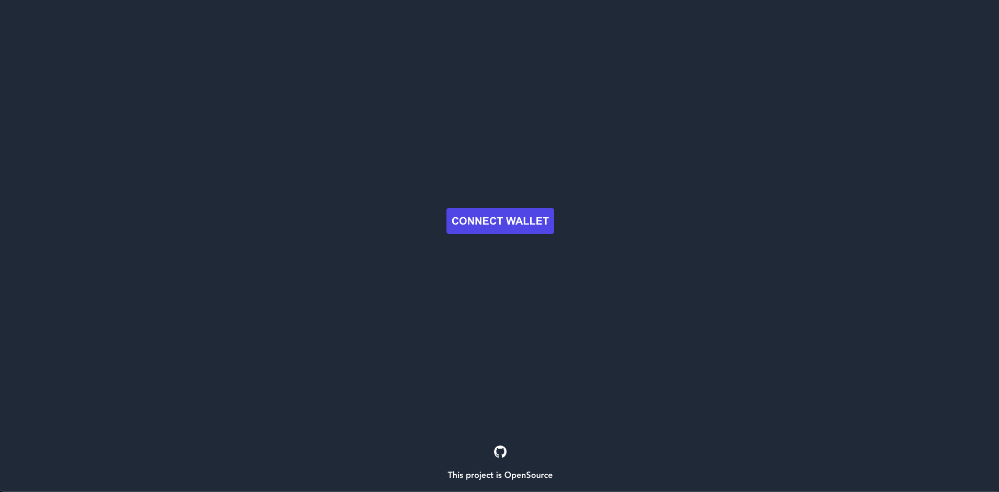
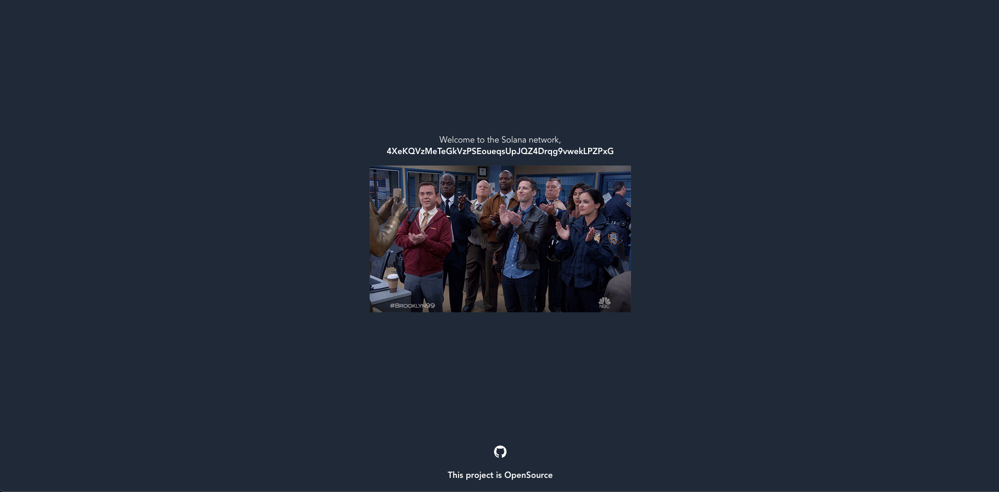
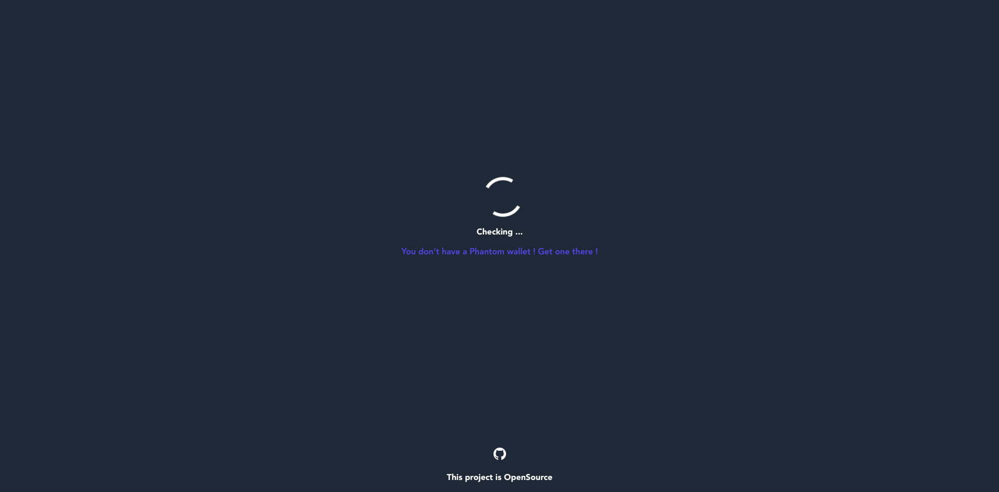

# Vue3-solana-boilerplate

Vue3-solana-boilerplate is a Jamstack and open-source boilerplate project that connect your Frontend with the Solana
network using the amazing Phantom wallet.

I'm currently working on it to add more features.

## Setup

```
npm install
npm run dev
```

## Build

```
npm run build
```

## What you will find ?

### Not connected



### Connected



### No Phantom wallet detected in your browser



## Made with Vue 3 + Typescript + Vite

This boilerplate should help get you started developing Solana Web3 application with Vue 3 and Typescript in Vite. The
template uses Vue 3 `<script setup>` SFCs, check out
the [script setup docs](https://v3.vuejs.org/api/sfc-script-setup.html#sfc-script-setup) to learn more. You can either
use the classic [composition API](https://v3.vuejs.org/api/composition-api.html#setup) if you prefer.

### Inspired by:

This project is made has a response to Icesofty who did a Jamstack and open-source
boilerplate [project](https://github.com/Icesofty/nuxt-solana-boilerplate) with NuxtJs and solana Phantom. He said that
it will be cool to have one made with VueJs, so here it is!

Thanks to [Icesofty](https://github.com/Icesofty) for the Inspiration

### Social network

Made by this
guy ! [Mohamed Ghoubali](https://www.linkedin.com/in/mohamed-ghoubali-9a698187/)  